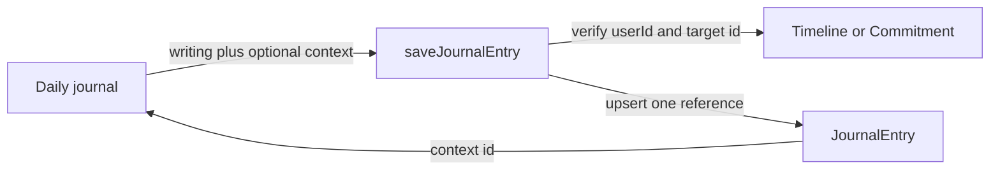

## Context

`JournalEntry` currently stores one user's AM/PM writing for one local calendar
day. The authenticated `/daily` route loads those entries into
`DailyRitual`; `saveJournalEntry` performs the upsert. Timelines and commitments
already have stable ids and owner ids, but no journal relationship exists.

The journal must remain structurally private and emotionally separate from
commitment proof. This change is additive and must not require a production
migration or deployment during implementation.

## Goals / Non-Goals

**Goals:**

- Persist one optional owned timeline or commitment on a journal entry.
- Validate ownership at the server boundary.
- Make the relationship visible and navigable in today's writer and the recent
  journal reader.
- Preserve journal writing if a related target is later removed.

**Non-Goals:**

- Creating a generic polymorphic relation framework.
- Linking one entry to multiple targets or to unnormalized hobby strings.
- Creating stamps, changing progression, or publishing journal data.
- Reworking discovery, timelines, commitments, or the 21-day journal reader.

## Decisions

### Use two nullable foreign keys with a single-context check

Add nullable `timelineId` and `commitmentId` columns to `JournalEntry`, both
with `ON DELETE SET NULL`, indexes, and a database check that prevents both from
being non-null. This keeps referential integrity explicit and preserves writing
when a target is removed.

A generic `targetType` plus `targetId` was rejected because SQLite cannot
enforce a foreign key across multiple target tables. A separate link table was
rejected because one optional context does not need many-to-many machinery.
An unnormalized `hobbyName` alone was rejected because it would not create a
navigable bridge to a durable Living object.

### Pass a typed union through the save action

The client sends `null`, `{ kind: "timeline", id }`, or
`{ kind: "commitment", id }`. The server resolves exactly one owned target and
sets both columns in the same journal upsert. Invalid or cross-user ids fail
before the write.

The action also exposes a lightweight context-choice query. It returns only
owned timelines and non-abandoned commitments with labels and private routes;
it does not load commitment stamps or public-profile data.

### Keep presentation inside the existing journal card

Today's editor gets one optional context selector near the writing field.
The current and historical entries render a quiet context link when one
exists. Signed-out preview data has no choices and remains read-only.

This preserves the established daily ritual hierarchy instead of adding a new
page or navigation surface.

## Risks / Trade-offs

- **[Risk] The schema permits legacy rows with neither context.** → This is
  intentional; the feature is optional and the additive migration has no
  backfill.
- **[Risk] A forged context id could cross user boundaries.** → Query by both
  target id and authenticated user id before any upsert.
- **[Risk] A deleted target could strand writing.** → `ON DELETE SET NULL`
  preserves the journal entry and removes only its context.
- **[Risk] Adding context could feel like proof or scoring.** → Use neutral
  "Related to" language and trigger no progression side effects.
- **[Trade-off] One context cannot describe a day spanning several plans.** →
  One keeps selection and reading lightweight; multi-context linking requires
  separate product evidence.

## Migration Plan

1. Generate an additive SQLite migration for the two nullable references,
   indexes, and single-context check.
2. Update code, tests, and docs; verify against a local database only.
3. Merge code to `main` while leaving the production migration and deployment
   to the existing manual operator process.
4. If application rollback is needed before production migration, revert the
   code. Once migrated, the nullable columns can remain harmlessly unused.

## Open Questions

None for this bounded slice.
