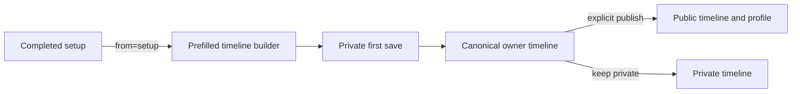

## Context

Setup already captures a username, birth year, a hobby the user stopped, two
diagnostic answers, and one first habit. It persists the diagnostic answers,
then ends at `/dashboard`. Timeline creation is a separate general-purpose
builder: a user chooses a template, saves a private timeline, lands on its
owner view, and may later find the visibility dropdown.

The product promise requires a quicker first creation loop, but Living content
is opt-in public. The change must improve continuity without making consent
implicit.

## Goals / Non-Goals

**Goals:**

- Carry the hobby already named in setup into an editable starter timeline.
- Keep the ordinary builder unchanged outside the setup entry path.
- Recognize the first timeline save and land on the canonical owner route.
- Explain the privacy state and offer one clear, explicit publish action.
- Give the owner a direct path to the profile after publication.

**Non-Goals:**

- Automatically publishing a timeline or changing default visibility.
- Replacing templates, timeline editing, or the existing visibility menu.
- Requiring a hobby answer when the user skipped it.
- Adding onboarding state, database columns, or analytics events.
- Deploying the application.

## Decisions

### Reuse persisted onboarding answers instead of putting the hobby in the URL

The final setup step links to `/timeline/new?from=setup`. The server reads the
authenticated user's existing `onboardingData` only for that explicit entry
path and passes a bounded hobby string to the builder. Setup awaits the existing
answer save before showing completion, so the handoff is deterministic.

Putting the hobby in a query string was rejected because the answer would be
copied into history and logs. Adding a new database column was rejected because
the answer is already persisted.

### Prefill one editable present-day phase

When a usable setup hobby exists, the new builder skips the template chooser
and starts with a titled timeline containing one `Now` phase and that hobby.
Every field remains editable, and “Change template” remains available. When
the hobby was skipped or setup context is absent, the existing template picker
is unchanged.

New-timeline edits use one local draft key until the first successful save.
That preserves work across refresh, an accidental navigation, or an
authentication interruption; a restored user draft outranks the initial setup
starter.

### Return first-save navigation metadata from the server

`saveTimeline` already counts prior timelines for activation analytics. It will
return whether the save was first and the canonical owner path derived from the
authenticated username and generated slug. The client uses that path for the
first-save completion state and otherwise keeps current navigation.

### Publish only from an owner-only completion prompt

The canonical timeline route shows the prompt only when the `first` completion
marker is present, the viewer owns the timeline, and it is still private. The
primary action calls the existing ownership-checked visibility action with
`PUBLIC`; the secondary action dismisses the marker and leaves data untouched.
Consent copy states that public timelines may appear in discovery and search,
not only on the profile. After publication, the route reloads from server truth
before showing confirmation, so the existing visibility control and success
message cannot disagree.

The query marker is presentation state, not authority. Spoofing it cannot
expose or modify another user's timeline because the route and action both
enforce ownership.

## Risks / Trade-offs

- **Onboarding answer save could race navigation.** → Await the existing answer
  save before setup completion.
- **The query marker can be copied.** → Gate the prompt by owner and current
  private visibility; it grants no capability.
- **A prefilled timeline can feel prescriptive.** → Use one editable `Now`
  phase and retain “Change template.”
- **Creation can be interrupted before authentication or save.** → Persist one
  local new-timeline draft and clear it only after successful creation.
- **Publication could be mistaken for automatic.** → State “Private now” and
  require a labeled owner click before changing visibility.
- **Users who skipped the hobby get no starter.** → Preserve the existing
  template path instead of inventing personal content.

## Migration Plan

1. Add pure starter/prompt helpers and focused tests.
2. Wire setup, builder, save result, and owner completion prompt.
3. Verify ordinary, skipped-hobby, signed-out, keep-private, and publish paths.
4. Merge without a database migration or deployment.

## Open Questions

None for this bounded slice.
