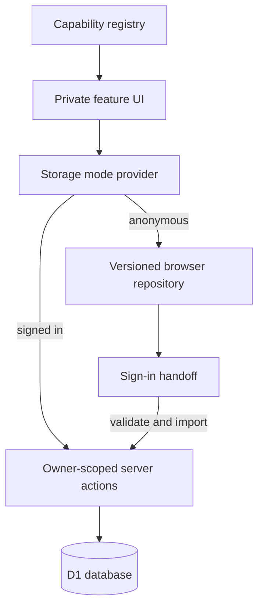

## Context

Private writes currently call authenticated server actions directly, while selected signed-out routes render read-only samples. There is no shared client-side persistence contract, no application-wide indication of storage authority, and no sign-in handoff. See `proposal.md` for motivation and the two delta specs for observable behavior.

The application uses server components, client components, Better Auth, Drizzle, and D1. The solution must preserve owner checks on server writes, require no new production dependency, and avoid treating browser data as public or trusted server input.

## Goals / Non-Goals

**Goals:**

- Make storage authority explicit and consistent across migrated surfaces.
- Provide substantial structured browser persistence, beginning with Trajectory.
- Preserve anonymous work safely through authentication and intermittent failures.
- Establish an adapter that lets feature clients use the same domain operations in either mode.
- Produce an inventory and staged path for every private application domain.

**Non-Goals:**

- Anonymous public publishing, community identity, or cross-device synchronization.
- A service worker, offline network cache, or conflict-free collaborative editing.
- Moving authenticated database data into browser storage as a second authority.
- Migrating every private feature in one unreviewable code change.

## Decisions

### 1. Session state selects the only active authority

A top-level storage-mode provider derives `local` or `account` from the server-confirmed session and exposes it with a small status component. Feature repositories receive this mode; individual pages do not independently infer persistence.

Alternative considered: attempt database writes and fall back locally on error. Rejected because network failure is not equivalent to being anonymous and would create two uncoordinated authorities for signed-in users.

### 2. Use IndexedDB for records and localStorage only for small metadata

Versioned domain envelopes live in IndexedDB because journals, timelines, histories, and other extensive data can exceed localStorage's synchronous and relatively small quota. localStorage holds only a storage schema version, anonymous installation identifier, and pending-import marker where synchronous boot visibility is useful. A thin in-repo wrapper uses native browser APIs, so no production dependency is added.

Alternative considered: store all JSON in localStorage. Rejected because synchronous serialization and quota limits are a poor foundation for the whole application.

### 3. Share domain validation, not persistence implementation

Each migrated feature exposes domain inputs and validation that both the local repository and authenticated server action use. The client calls a mode-aware feature service. Account mode continues through server actions and D1; local mode executes the equivalent lifecycle rules in a browser transaction.

### 4. Import is explicit, resumable, and idempotent

After sign-in, a coordinator inventories local domains and displays a one-time handoff. Each local record has a stable client-generated identifier, and import receipts map that identifier to the authenticated user and imported server record. The server validates every payload and enforces ownership and uniqueness. Local records remain until the complete selected import succeeds; afterward they are retained in a recoverable archive until the user confirms cleanup.

For single-active entities such as Trajectory, an existing account record wins by default. The user must explicitly choose whether to keep the account version, replace it through a valid domain transition, or leave the local version on the device. There is no timestamp-based silent overwrite.

### 5. Adopt by domain behind an honest capability registry

The first vertical slice covers Trajectory contracts and reviews end to end. A registry classifies each private domain as `local-ready`, `account-only`, or `public-server`. UI uses that registry to avoid editable anonymous forms on unmigrated account-only surfaces. Follow-up slices cover onboarding/profile drafts, bucket list, timelines, side quests, commitments/habits, Daily entries, and look-back inputs.

## Risks / Trade-offs

- [Browser storage can be cleared or unavailable] -> Explain that local data stays on this device, detect storage failures, and provide export before destructive cleanup.
- [Sensitive private data remains on a shared device] -> Keep local storage opt-out and clear controls visible; never move it into analytics, logs, or public caches.
- [Two histories can exist at sign-in] -> Use an explicit conflict screen and account-authoritative default; never silently merge semantically exclusive records.
- [A whole-app conversion can sprawl] -> Land the shared contract plus Trajectory first, keep a checked inventory, and migrate one bounded domain at a time.
- [Server and local behavior can drift] -> Share schemas and pure lifecycle functions, then run contract tests against both repository implementations.

## Migration Plan

1. Add the storage-mode provider, browser repository foundation, capability registry, and failure handling with unit tests.
2. Convert Trajectory to the mode-aware repository and replace the signed-out sample with a locally durable editable state.
3. Add sign-in inventory, explicit handoff UI, idempotent server imports, and conflict tests for Trajectory.
4. Audit all private write domains and mark each honestly as local-ready or account-only.
5. Convert remaining domains in small slices, updating the registry and tests after each.
6. Keep account mode behavior unchanged throughout; rollback can disable local-ready flags without deleting browser data.
