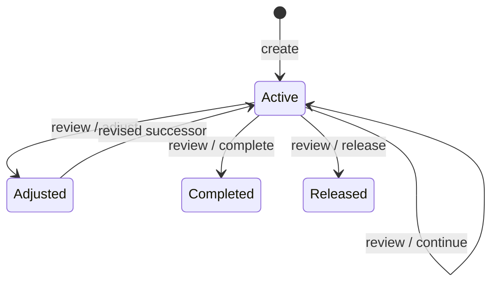

## Context

The current `/trajectory` is implemented as four fixed bucket eras plus monthly entries. Its tables may contain private user history and must not be deleted or semantically rewritten. The page already has authenticated and read-only preview modes, and all mutations use owner-scoped server actions. See `proposal.md` for motivation and `specs/trajectory-contract/spec.md` for behavior.

## Goals / Non-Goals

**Goals:**

- Introduce the contract as an additive private model with a database-enforced single-active invariant.
- Keep create, review, adjust, and close transitions atomic.
- Make contract history understandable without scores or automated judgment.
- Preserve the existing route, auth boundary, visual language, and historical tables.

**Non-Goals:**

- Migrating old bucket ideals into contracts.
- Linking contracts to habits, commitments, journals, or public artifacts in this first slice.
- AI-authored contracts, notifications, scheduled jobs, or automatic cadence enforcement.
- Removing legacy tables or running a production migration.

## Decisions

### Add contract and review tables instead of extending bucket eras

`TrajectoryContract` stores each version; `TrajectoryReview` stores decisions made against a version. This keeps legacy semantics intact and makes a review-led adjustment auditable. Extending `TrajectoryEra` was rejected because its bucket, ideal, and completed/abandoned semantics cannot faithfully represent a single cross-cutting contract.

An SQLite partial unique index on `userId` where `status = 'active'` enforces the single-active invariant in addition to transaction checks.

### Model adjustment as close-and-create

An adjustment closes the reviewed contract with status `adjusted` and creates a new active version linked through `previousContractId`. Complete and release close without creating a successor. Continue only adds a review. This produces immutable historical versions and simple current-state reads.

### Keep cadence informational in v1

Cadence is stored on the contract and shown in the review UI. No scheduler or streak mechanism is added. This satisfies the product's no-scoring constraint and lets the review interaction be validated before adding notifications.

### Derive changed fields at read time

The UI compares a version with `previousContractId` and labels changed parts. Four bounded text fields make this calculation trivial and avoid duplicating change metadata that could drift.

## Risks / Trade-offs

- [The old trajectory UI becomes inaccessible while its data remains stored] → Keep all legacy tables and server code initially, document the preservation boundary, and avoid destructive migrations.
- [Concurrent creates could produce two active contracts] → Add a partial unique database index and map constraint failure to a friendly result.
- [Four text fields can feel like homework] → Use short prompts, strong examples, sensible length limits, and a single-page form.
- [Cadence may imply reminders that do not exist] → Label it as “review rhythm” and describe it as the user's chosen check-in context, not a notification promise.

## Migration Plan

1. Add the two tables and partial unique index through a generated additive migration.
2. Deploy application code only alongside the migration in an operator-owned release.
3. Roll back application code independently; legacy trajectory data remains untouched, while new additive tables can remain dormant.
4. Do not drop either old or new data during rollback.
