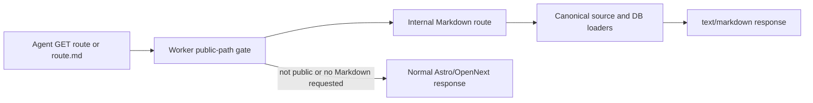

## Context

Significant Hobbies is an OpenNext Worker with an Astro homepage overlay, Next
server-rendered content routes, and a small generated edge handler for fixed
agent discovery files. The sitemap mixes static pages, source-backed content
families, and database-backed public profiles. Maintaining a second Markdown
renderer for every route would duplicate product truth and inevitably drift.

The existing Worker already sits in front of both Astro assets and OpenNext, so
it is the only boundary that can cover the complete mixed corpus consistently.
Public/private indexing remains defined by route patterns already represented in
the sitemap; auth-only routes must not become Markdown surfaces. Because
OpenNext streams React payloads, its initial response is not a complete
server-rendered `<main>` that can be converted reliably.

## Goals / Non-Goals

**Goals:**

- Return useful Markdown for every public sitemap route through
  `Accept: text/markdown`.
- Resolve the corresponding `.md` alternate without exposing private routes or
  returning an HTML shell for invalid agent paths.
- Keep Markdown faithful to the same canonical data and route loaders used by
  human pages.
- Preserve the existing Astro/OpenNext runtime and caching boundaries.
- Make the bounded `/api/ai` catalog internally consistent.

**Non-Goals:**

- Building a second editorial content system or copying the public corpus.
- Indexing authenticated daily, settings, dashboard, or private timeline data.
- Redesigning public pages, changing navigation, or deploying the Worker.
- Adding third-party HTML/Markdown conversion packages.

## Decisions

### Render Markdown from canonical source data behind the Worker boundary

The Worker will recognize only sitemap-owned public path families. For a
negotiated route or `.md` alternate, it will call an internal Next route that
dispatches the pathname to a source-backed Markdown renderer. The renderer
imports the same hobby, experience, journey, bucket-list, editorial, and
database loaders used by human routes. This avoids copying the 580 generated
documents while producing complete content before React streaming.

Converting OpenNext HTML was rejected after a local runtime probe showed that
the initial response is a React/Flight shell rather than a complete `<main>`.
Direct external refetching was rejected because it adds latency, recursion risk,
and environment-dependent network behavior.

### Restrict Markdown generation to explicit public route families

The path gate will include the exact public static routes and bounded dynamic
families present in `sitemap.ts`. It will exclude authenticated and private
application routes even if they happen to render a guest shell. Tests will
compare every generated sitemap entry with the path gate, turning future sitemap
growth into a deliberate Markdown-coverage decision.

An unrestricted converter was rejected because `/daily.md` or
`/settings.md` would contradict `/api/ai.auth` even when no personal data is
returned.

### Use a dependency-free, semantics-first source renderer

The renderer will map canonical source objects into headings, paragraphs, lists,
quotes, and links, normalize whitespace, and prepend a source URL. If no public
source object exists, it will fail rather than label a guest/error shell as an
agent-readable page.

No production dependency is warranted. Unit tests cover each source family,
empty/error results, full sitemap coverage, and private-route exclusion.

### Treat fixed discovery surfaces separately

`llms.txt`, `llms-full.txt`, `index.md`, and `/api/ai` remain fixed edge
responses. `/api/ai` will advertise `/explore.md` for Explore, and both its URL
and Markdown target will stay same-origin and sitemap-listed. Fixed files will
not be routed through the document converter.

### Correct metadata at route-family definitions

Repeated SEO fixes belong in the `generateMetadata` functions for their route
families. Each detail page will provide a self-referencing canonical, concise
title that relies on the root title template only once, and a default OG image
when no page-specific image exists.

## Risks / Trade-offs

- **Source schemas can change** → Import canonical typed loaders and cover every
  current generated sitemap route in tests.
- **A new sitemap family could lack Markdown** → A full generated-sitemap test
  must fail until the public path gate is updated.
- **SSR work adds cost for Markdown requests** → Reuse public cache headers and
  cache successful Markdown at the edge; no extra work occurs for HTML traffic.
- **Live source errors could otherwise become Markdown** → Return an explicit
  Markdown failure when a public source object cannot be loaded.
- **Generated `/api/ai` data can drift from the Fleet registry** → Update both
  checked-in product payloads now and keep the Fleet registry aligned.
